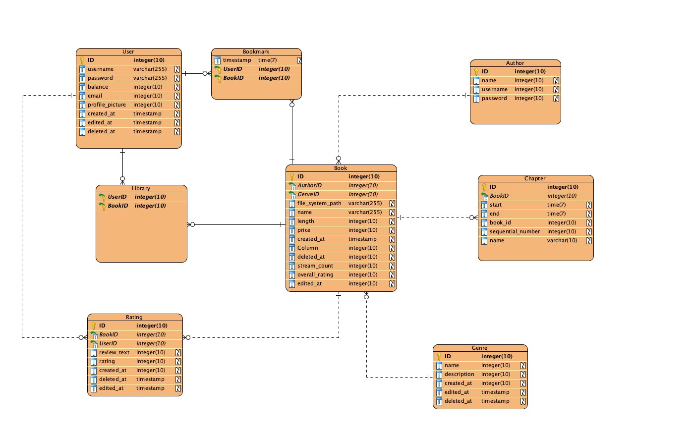

# AudioHub

by *ninna29*, *hafo0*, *_sykyy*, *pavelko_69705*

## Overview

AudioHub is a comprehensive digital platform designed for content creators to share their audiobooks.  

The website is deployed and published in a Kubernetes cluster. 

Use this link https://audiohub.dyn.cloud.e-infra.cz/ to evaluate the app without having to set up your own Postgres instance and clone this repo.
## Architecture
The application is built using Actix, Askama and HTMX.

## Database Schema


## Setup
We have provided multiple options to test and deploy this web application for you. 

If you choose a local deployment, please bear in mind that media files are stored locally for obvious reasons (DB size, RAM). 
But we will include a couple of short songs and thumbnails in this repository (in static files) to showcase the functionality out of the box. 

You should add your owns books though.  

Note that the app may not work correctly in certain browsers.
For example Firefox does buffering differently to Chrome, which results in chapter jumps and general seeking
working poorly and requiring a lot off buffering on Firefox.

### Kubernetes
The application is deployed using CERIT-SC's Kubernetes cluster: https://audiohub.dyn.cloud.e-infra.cz/ for your convenience.

While we do not intend to modify our project after submission, we understand your need to check the project at the time of submission. Therefore, we provided another option to test the app locally.

### docker-compose
Simply run `docker-compose up` to build and run all the necessary containers including Postgres and NGINX. 

Note that the AI recommender might not work properly.

### Local app - Local Postgres with our DB contents
If you do not wish to use our database you can always restore the database by running migrations or from dump `dump.sql`.

## Evaluation
Use any of those credentials to log into to https://audiohub.dyn.cloud.e-infra.cz/ or your local instance (as long as migrations have been successfully applied).

Since we've published this project into the world, these credentials are no longer valid.

| username | email | name | surname | password |
| :--- | :--- | :--- | :--- | :--- |
| charlie | c@c.com | Charles | Dickens | Aa123! |
| sop | s@s.com | Sophocles | of Greece | Aa123! |
| archie | a@a.com | Arthur Conan | Doyle | Aa123! |
| n | n@n.com | Ninka | Rybka | Aa123! |
| r | r@r.com | Roman | Mar | Aa123! |
| v | v@v.com | Vojta | Syk | Aa123! |
| p | p@p.com | Pavel | Koh | Aa123! |

## Deployment
We chose the CERIT-SC's Kubernetes cluster to deploy this application. YAML manifests used to do so are located in the `kubernetes` folder.

The Kubernetes' NGINX ingress controller automatically creates a trusted certificate and sets up the NGINX reverse proxy. For this reason we have not set up HTTPS in the app. 

There are other options too, but you should secure the website with a reverse proxy yourself:
- for bare metal deployment you could run `cargo build` and then create a *systemd* unit to manage it.
- for Docker deployment you should firstly run `docker build -t audiohub-image .` to build the image and then `docker run -p 80:8000 --name audiohub audiohub-image --restart=always`.
- for Podman deployment the steps would be similar `podman build -t audiohub-image .` to build the image. But Podman containers are daemon-less, therefore it is recommended to use so called *Quadlets* to manage Podman containers with *systemd*.
- use our docker-compose file that sets up the app, database and nginx equipped with a self-signed certificate.

Something like this should work. Note that I did not test it, paths may be incorrect. I provide this example just as a curiosity.
```shell
[Unit]
Description=AudioHub
After=network-online.target

[Container]
Image=audiohub-image
ContainerName=audiohub
PublishPort=80:8000
Volume={{ local_volume_path }}:/usr/src/audiobooks/media:z

[Service]
Restart=always
TimeoutStartSec=900

[Install]
WantedBy=multi-user.target default.target
```

***

### Language based recommender system - gRPC

To utilize the AI Audiobook Recommender, powered by a language model 
that analyzes genres and book descriptions, you need to follow these steps:

#### build.rs Configuration

The `build.rs` file houses the build target configuration necessary for compilation. 
To generate the required libraries, execute the command:
```
cargo build
```
This command triggers the compilation process, ensuring the creation of the relevant
libraries for your project.

#### Running the gRPC Server

If you want to have book recommanded by Artificial intelligence language model based on 
genre and book description analysis you have to run docker with gRPC server first.

Run these commands in project root directory:

```
docker build -t ai-audiobook-recommander -f Dockerfile.recommender-server .
docker run -p 50051:50051 ai-audiobook-recommander
```

Once the Recommender Server is up and running, you can run audiobook application 
to receive AI-based audiobook recommendations.

